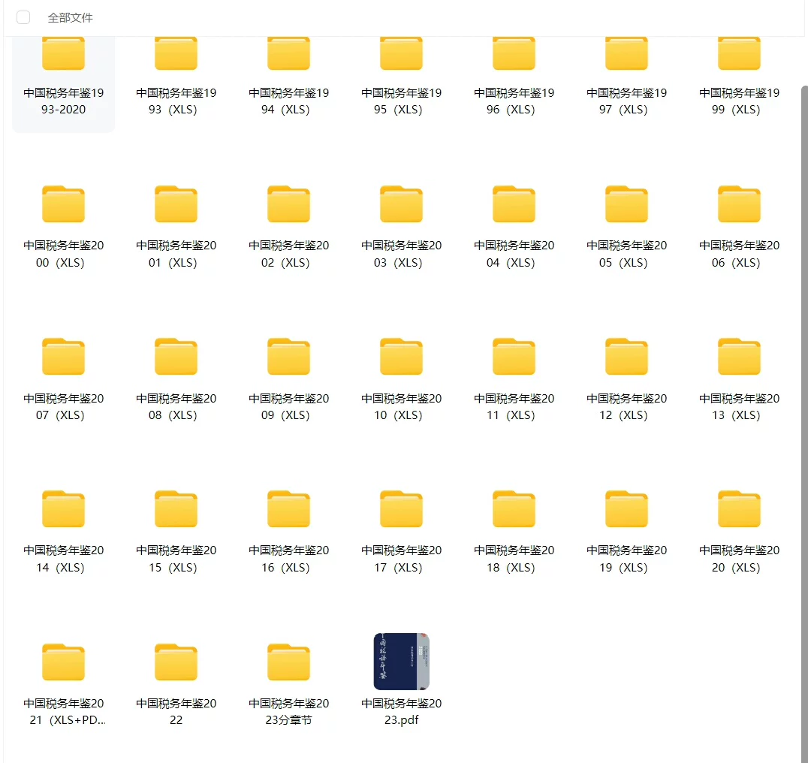
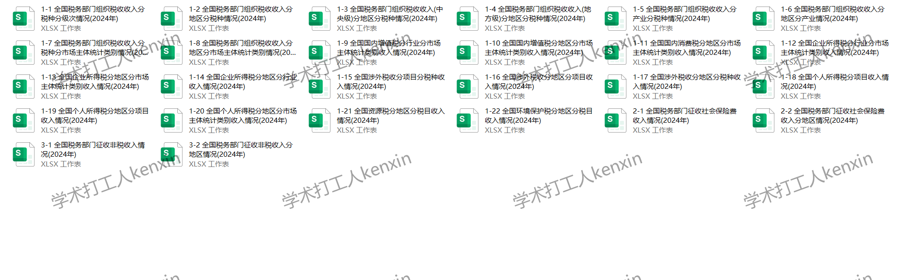
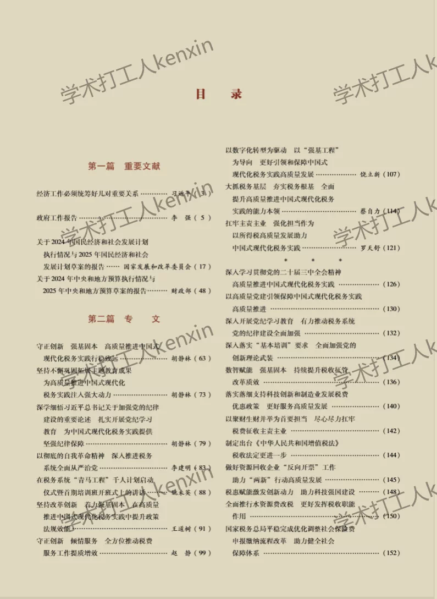
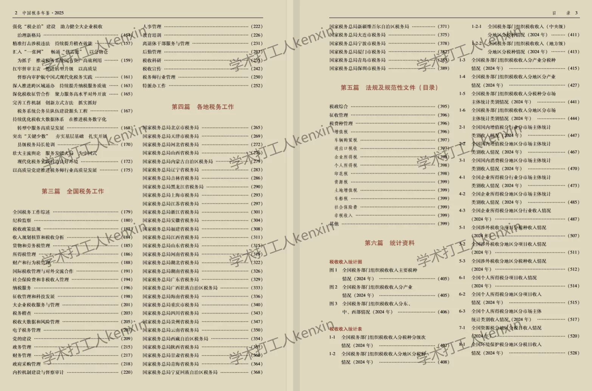
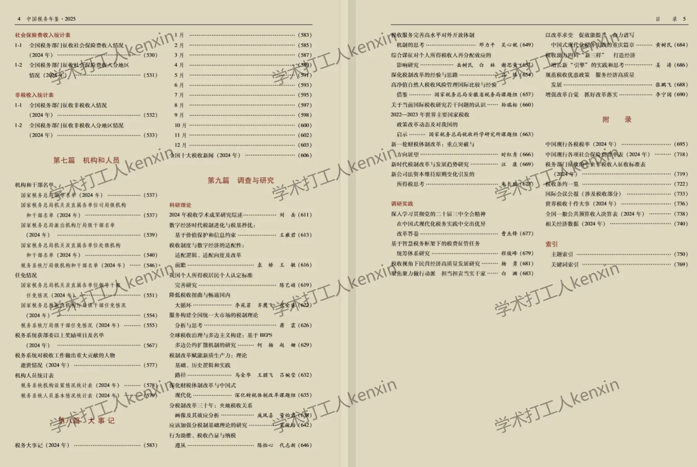

## Body

China Tax Yearbook Data (1993-2025)

Year of publication: The China Tax Yearbook was first published in 1993, documenting the significant journey of taxation development. It fully showcases the practices and achievements of tax reform and development, characterized by authority, comprehensive data, and rich content. It is hailed as an encyclopedia of tax work and a crucial window for all sectors of society to understand the overall picture of taxation and its historical and cultural context.

Indicator Details: The directory is available for reference through images, please view them on your own. If you need assistance finding specific indicators, feel free to contact us. We do not offer data help without prior request, and we do not support returns without reason.
The display covers the year 2025, with a vast amount of content. For those who wish to use search engines to familiarize themselves with the directory's content beforehand, different statistical years may have varying standards. Please be aware of this academic knowledge.

Data Content: Both PDF and Excel versions are available. From 2020 onwards, it was primarily in Excel format. In 2021 and 2022, both Excel and PDF versions were used (the 2022 Excel version was converted from data, requiring verification after copying). From 2023 to 2024, it was exclusively in PDF format. By 2025, both PDF and Excel versions were available, some of which are zipped files that require downloading and unzipping before use. The file location has been shown in the images; please review carefully before purchasing. Those who are sensitive to such details should avoid purchasing.

## Images

item_1073057369259

Here is a pay link on Stripe ( https://buy.stripe.com/3cs8yP7sY87d0vu9AB ). Please contact me lonlonago@foxmail.com after funding $89, and I will send you a complete data files , thank you!

